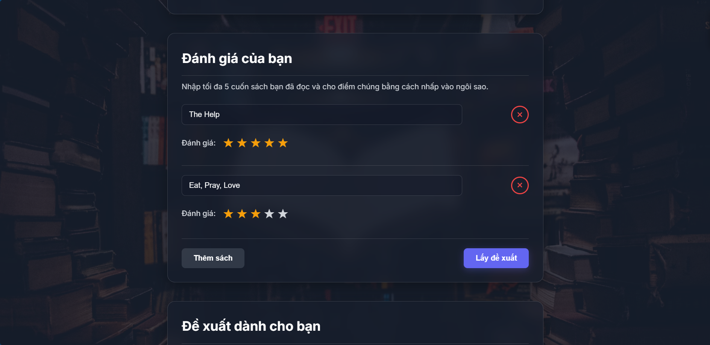
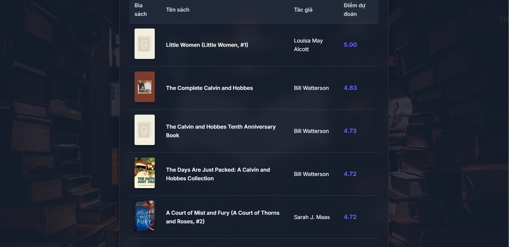

# 📚 Book Recommendation System (Flask API)

Ứng dụng Flask gợi ý sách dựa trên:
- **Surprise KNN model** (`model/knn_basic_best-para_20k.pkl`)
- **Custom recommender** (5 hàng xóm → 25 sách tiềm năng → chọn 5, fallback luôn đủ 5).

---

## 🖼️ Hình ảnh demo về web "Book Recommend System"

### Trang chủ


### Rating - Chấm điểm


### Kết quả gợi ý


---

## 📂 Cấu trúc thư mục

```
Book-Recommendation-System/
│── app.py                # Flask server
│── README.md             # Hướng dẫn
│── requirements.txt      # Dependencies
│
├── data/
│   ├── books.csv
│   ├── ratings.csv
│
├── model/
│   └── knn_basic_best-para_20k.zip   # nén lại để upload lên GitHub
│
└── templates/
    └── new.html          # Giao diện web
```

---

## Dataset dùng để train
[Books Dataset](https://www.kaggle.com/datasets/saurabhbagchi/books-dataset)
```
Dùng dataset từ link: https://www.kaggle.com/datasets/saurabhbagchi/books-dataset
```

## ⚙️ Cài đặt

### 1. Tạo môi trường ảo (khuyến nghị)
```bash
conda create -n Book python=3.10 -y
conda activate Book
```

### 2. Cài dependencies từ file `requirements.txt`
```bash
pip install -r requirements.txt
```

---

## 📦 Giải nén model

Sau khi clone project từ GitHub, vào thư mục `model/` và **giải nén file zip**:

```bash
cd model
unzip knn_basic_best-para_20k.zip
```

Kết quả: trong thư mục `model/` sẽ có file:

```
knn_basic_best-para_20k.pkl
```

---

## ▶️ Chạy server

```bash
python app.py
```

Sau đó mở trình duyệt và truy cập:

```
http://localhost:5000
```

Trang `new.html` trong thư mục `templates/` sẽ được hiển thị.

---

## 📡 API chính

- `/` → render `new.html`
- `/popular_books` → trả về 10 sách ngẫu nhiên trong top 50
- `/autocomplete?query=abc` → gợi ý sách theo tiêu đề
- `/recommend` (POST form) → legacy (dùng Surprise model)
- `/recommend` (POST JSON) → custom recommender, luôn trả về đúng 5 sách

---

## 📝 Ghi chú

- Luôn trả về đúng **5 sách** (fallback hai tầng khi cần).
- Nếu `new.html` trống → trang chủ sẽ hiển thị trắng (không phải lỗi).
- **Model:** cần giải nén `knn_basic_best-para_20k.zip` để có file `.pkl`.
- **Cài đặt scikit-surprise:** nếu gặp lỗi, hãy dùng Python ≤ 3.11 và cài bằng file `.whl`.
